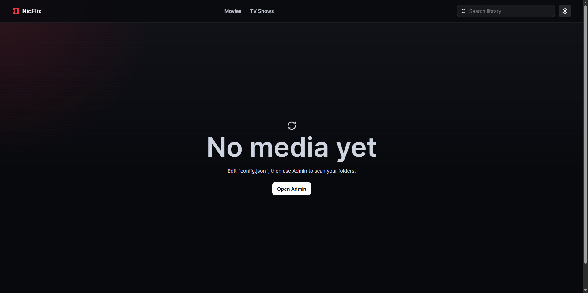

# NicFlix

Local-first media server for browsing and streaming your own movie and TV library.

NicFlix is built with Node.js, Express, SQLite, Vite, and React. It runs on your machine, scans folders you choose, stores metadata locally, and plays media directly in the browser.

## Preview

Preview images are stored in [assets](assets/).




## Features

- Movie and TV show libraries with poster, backdrop, metadata, and technical media details.
- Home rows for continue watching and recently added titles.
- Movie detail pages, TV show detail pages, season tabs, episode cards, and suggested shows.
- Global search across titles, original titles, and episode names.
- Direct browser playback with resume progress, watched tracking, fullscreen, picture-in-picture, keyboard shortcuts, and volume controls.
- TV playback navigation with previous/next episode buttons, an episode playlist, and optional auto-play next episode.
- Subtitle support for embedded tracks and nearby external subtitle files, including common subtitle folders such as `subs` and `subtitles`.
- Experimental skip intro, recap, outro, and credits buttons using IntroDB segment data when available.
- Admin-managed libraries, scans, content review, metadata edits, and cleanup.
- Admin-managed TMDB connection with key testing, encrypted app config storage, disconnect support, and optional server environment fallback.
- TMDB metadata matching for movies, shows, seasons, episodes, posters, backdrops, ratings, runtimes, genres, and IMDb IDs.
- Local image picker for poster and backdrop overrides.

## Setup

### One-click Windows install

Double click `install.bat`.

The installer creates local files from the checked-in examples and installs all npm dependencies:

- `apps/server/.env` from `apps/server/.env.example`
- `config.json` from `config.example.json`

Then double click `Start NicFlix.bat`.

Open Admin in NicFlix to add your media folders, scan them, and connect your TMDB API key for metadata lookup.

### Manual setup

1. Copy `apps/server/.env.example` to `apps/server/.env`.
2. Copy `config.example.json` to `config.json`.
3. Install dependencies:

```sh
npm install
```

4. Start both apps:

```sh
npm run dev
```

Frontend: `http://localhost:5182`  
Backend: `http://localhost:4000/api`

Open Admin in NicFlix to add your media folders, scan them, and connect your TMDB API key for metadata lookup.

## Admin

Admin is where you manage the server after install:

- Add movie and TV libraries, browse for folders, and scan them.
- Review all scanned media or only items that still need metadata.
- Run TMDB matching for one item or use **Match All** for pending items.
- Edit titles, years, posters, backdrops, overviews, genres, runtimes, ratings, TMDB IDs, and IMDb IDs.
- Remove scanned libraries or media records without deleting files from disk.
- Configure player defaults for skip intro/outro and auto-play next episode.

## TMDB metadata

NicFlix can store and test your TMDB API key from Admin. Open Admin, go to **General**, paste your free TMDB v3 API key, and choose **Test** or **Save API Key**.

Saved app-managed keys are encrypted in `config.json` using a local secret in `data/app.secret`. For server-managed deployments, you can still set `TMDB_API_KEY` in `apps/server/.env`. Admin will show whether the active key is coming from app settings or the server environment.

When TMDB is connected, scans and manual matches can fill movie, show, season, and episode metadata. Posters and backdrops downloaded from TMDB are stored under `data/posters/` and `data/backdrops/`.

## Media and subtitles

Scans currently recognize `.mp4`, `.mkv`, `.mov`, `.avi`, and `.webm` files.

NicFlix detects TV episodes from common filename patterns such as `Show Name S01E02`, `Show Name 1x02`, and season-folder layouts. Nearby external subtitles are detected when they match the video filename or live in subtitle folders such as `subs`, `subtitles`, or `subtitle`.

## Notes

NicFlix streams MP4/H.264/AAC files directly to the browser and uses FFmpeg on demand for files with browser-unfriendly containers or audio codecs, such as MKV files with EAC3 audio.

FFmpeg/ffprobe should be available on your system for media probing and subtitle extraction/conversion features.
